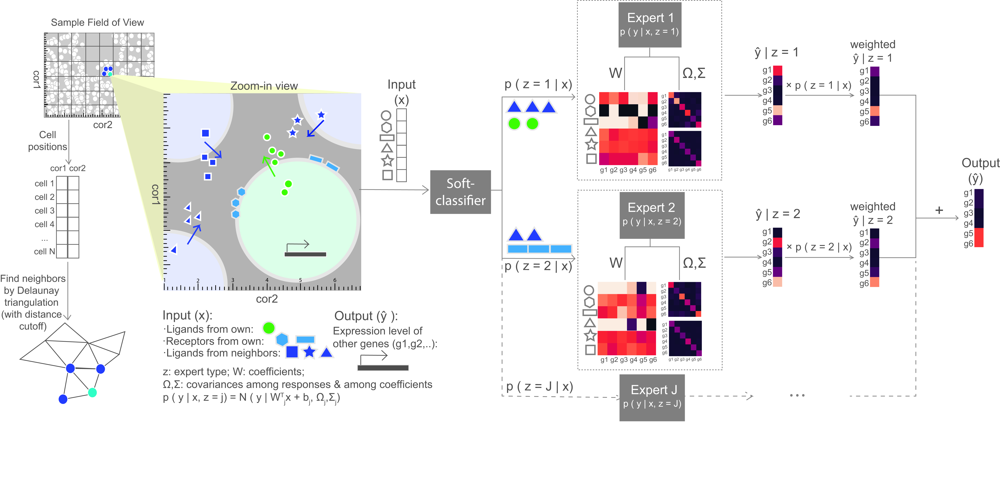

# Introduction
MESSI (**M**ixture of **E**xperts for **S**patial **S**ignaling genes **I**dentification) is a predictive framework to identify signalling genes active in cell-cell interaction. It jointly models gene interactions within and between cells, using the recently developed spatial single cell expression data. MESSI combines the ability to subdivide cell types with multi-task learning to accurately infer the expression of a set of response genes based on signaling genes and to provide useful biological insights about key signaling genes and cell subtypes. 

# Get started 
## Prerequisites 
* Python >= 3.7.3 
* Python side-packages:
-- scikit-learn >= 0.22.1
-- scipy >= 1.3.0  
-- numpy >= 1.16.3  
-- pandas >= 0.25.3

