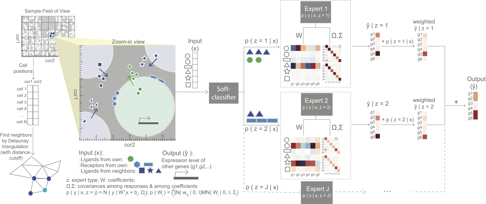

# Introduction
MESSI (**M**ixture of **E**xperts for **S**patial **S**ignaling genes **I**dentification) is a predictive framework to identify signaling genes active in cell-cell interaction. It jointly models gene interactions within and between cells, using the recently developed spatial single cell expression data. MESSI combines the ability to subdivide cell types with multi-task learning to accurately infer the expression of a set of response genes based on signaling genes and to provide useful biological insights about key signaling genes and cell subtypes. 



# Get started 
## Prerequisites 
* Python >= 3.6
* Python side-packages:  
-- scikit-learn >= 0.22.1  
-- scipy >= 1.3.0  
-- numpy >= 1.16.3  
-- pandas >= 0.25.3  

## Installation 

```shell
sudo pip3 install --upgrade  https://github.com/doraadong/MESSI/tarball/master
```

# Command-line usage 

## Download expression data and convert to required formats:

Download the script [utils/readyData.py](utils/readyData.py). 

Execute this python script by (arguments are taken for example): 

```shell
python readyData.py -i ../input/ -d merfish
```
The usage of this file is listed as follows:  

```shell
usage: readyData.py [-h] -i INPUT -d DATATYPE

optional arguments:
  -h, --help            show this help message and exit
  -i INPUT, --input INPUT
                        string, path to the folder to save the expression
                        data, default '../input/'
  -d DATATYPE, --dataType DATATYPE
                        string, type of expression data, default 'merfish'

```

## Train (and test) MESSI model 

Run MESSI by (arguments are taken for example): 

```shell
messi -i ../input/ -o ../output/ -d merfish -g Female -b Parenting -c Excitatory -m train -c1 1 -c2 8 -e 5
```
The usage of this file is listed as follows:  

```shell
usage: messi [-h] -i INPUT -o OUTPUT -d DATATYPE -g GENDER -b BEHAVIOR -c
             CELLTYPE -m MODE -c1 NUMLEVEL1 -c2 NUMLEVEL2 [-e EPOCHS]
             [-r NUMREPLICATES] [-p PREPROCESS] [-tr TOPKRESPONSES]
             [-ts TOPKSIGNALS]

optional arguments:
  -h, --help            show this help message and exit
  -i INPUT, --input INPUT
                        string, path to the input folder with the expression
                        data, default '../input/'
  -o OUTPUT, --output OUTPUT
                        string, path to the output folder, default
                        '../output/'
  -d DATATYPE, --dataType DATATYPE
                        string, type of expression data, default 'merfish'
  -g GENDER, --gender GENDER
                        string, gender of input animal sample, default
                        'Female', put 'na' if not available
  -b BEHAVIOR, --behavior BEHAVIOR
                        string, behavior of input animal sample, default
                        'Naive', put 'na' if not available
  -c CELLTYPE, --cellType CELLTYPE
                        string, cell type that will be built a model for, use
                        \ for white-space, e.g. 'OD\ Mature\ 2', default
                        'Excitatory'
  -m MODE, --mode MODE  string, any of 'train', 'CV'; if 'train', then all
                        data will be used for training and output a pickle
                        file for learned parameters; if 'CV', then cross-
                        validation will be conducted each time with an
                        animal/sample left out and each CV run output a pickle
                        file and prediction result, default 'train'
  -c1 NUMLEVEL1, --numLevel1 NUMLEVEL1
                        integer, number of classes at level 1, number of
                        experts = number of classes at level 1 x number of
                        classes at level 2, default 1
  -c2 NUMLEVEL2, --numLevel2 NUMLEVEL2
                        integer, number of classes at level 2, default 5
  -e EPOCHS, --epochs EPOCHS
                        integer, number of epochs to train MESSI, default 20
  -r NUMREPLICATES, --numReplicates NUMREPLICATES
                        integer, optional, number of times to run with same
                        set of parameters, default 1
  -p PREPROCESS, --preprocess PREPROCESS
                        string, optional, the way to include neighborhood
                        information; neighbor_cat: include by concatenating
                        them to the cell own features; neighbor_sum: include
                        by addinding to the cell own features; anything
                        without 'neighbor': no neighborhood information will
                        be used as features, default 'neighbor_cat'
  -tr TOPKRESPONSES, --topKResponses TOPKRESPONSES
                        integer, optional, number of top dispersed responses
                        genes to model,default None (to include all response
                        genes)
  -ts TOPKSIGNALS, --topKSignals TOPKSIGNALS
                        integer, optional, number of top dispersed signalling
                        genes to use as features, default None (to include all
                        signalling genes)
```

# Tutorials
See [tutorials/MESSI_merfish_hypothalamus.ipynb](tutorials/MESSI_merfish_hypothalamus.ipynb), for a detailed intro on how to train and test a MESSI model, to infer signaling genes and subtypes from the learned parameters and other possible model configurations. 

# Credits
The software is an implementation of the method MESSI, jointly developed by Dora Li, [Jun Ding](https://github.com/phoenixding) and Ziv Bar-Joseph from [System Biology Group @ Carnegie Mellon University](http://sb.cs.cmu.edu/).  

# Contacts
* dongshul at andrew.cmu.edu 

# License 
This project is licensed under the MIT License - see the [LICENSE.md](LICENSE.md]) file for details

